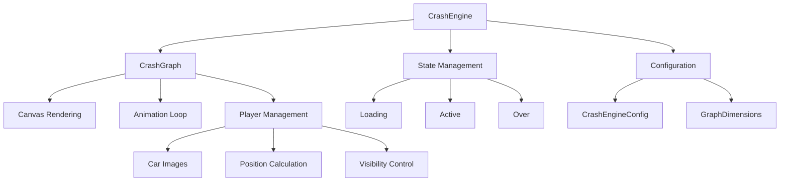
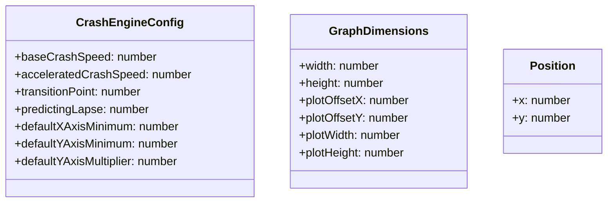
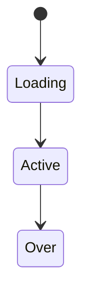
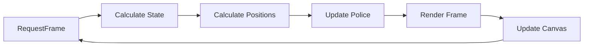

# System Patterns: Crash Game Graph Control

## Architecture Overview

## Core Design Patterns

### 1. Engine-View Separation
- **CrashEngine**: Pure logic class handling calculations and state
  - Encapsulated internal state with getter/setter methods
  - Configuration-driven through interfaces
  - Dual-speed rendering system for optimized performance
  - Transition point at 5x multiplier
  - Base speed for < 5x, accelerated speed for > 5x
  - Position and timing calculations for main car and police
- **CrashGraph**: React component for visualization
  - Police car follows main car with 1s delay
  - Maintains exact trajectory matching
  - Renders police car on top layer
  - Accesses engine state through getter methods
- Clear separation of concerns between business logic and presentation

### 2. Interface-Driven Configuration

### 3. State Management

- Managed through CrashEngineState enum
- Deterministic state transitions
- State affects multiplier calculations and rendering
- Protected state access through getters

### 4. Animation Pattern

- Uses requestAnimationFrame for optimal performance
- Continuous rendering loop while component is mounted
- Automatic cleanup on unmount

## Technical Architecture

### 1. Calculation System
- Two-phase logarithmic growth for multiplier values:
  - Base growth rate (0.00018) until 5x
  - Accelerated growth rate (0.00036) after 5x
- Smooth transition handling at 5x point
- Precise timing management for main car and police
- Lag detection and compensation
- Position tracking and trajectory replication
- Type-safe position calculations using Position interface

### 2. Rendering System
- Canvas-based drawing
- Quadratic curve interpolation
- Dynamic axis scaling and labeling
- Responsive to dimension changes through GraphDimensions interface
- Layer management for car overlaps
- Police car animation handling

### 3. Component Integration
- Props-based configuration
- Self-contained animation loop
- Clean mount/unmount lifecycle
- Multiple instance support
- Police car state management
- Image resource handling
- Encapsulated engine access through getter methods

## Error Handling
1. **Infinite Payout Protection**
   - Checks for infinite values
   - Throws error for invalid calculations
   - Maintains system stability

2. **Resource Management**
   - Proper cleanup of animation frames
   - Timer clearance on component unmount
   - Memory leak prevention

## Performance Optimizations
1. **State Access**
   - Encapsulated state with getter methods
   - Minimal state updates
   - Efficient property access patterns

2. **Render Efficiency**
   - Canvas clearing optimization
   - Minimal state updates
   - Efficient curve calculations
   - Optimized dimension calculations

3. **Memory Management**
   - Single canvas context reference
   - Cleanup of animation frames
   - Clear timeout handling
   - Protected internal state

## Code Organization
- Interface-driven design
- Clear separation of concerns
- TypeScript interfaces for type safety
- Encapsulated state management
- Configuration-based initialization
- Modular component structure
